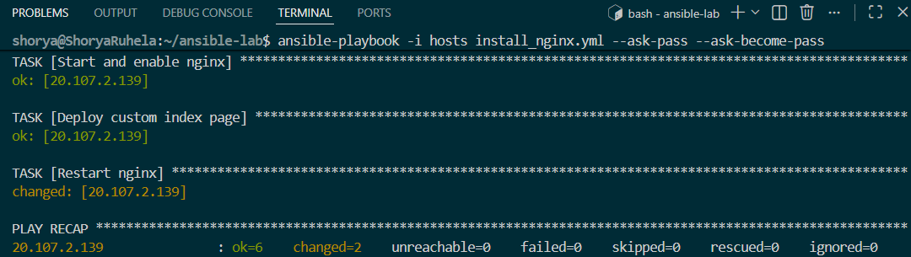
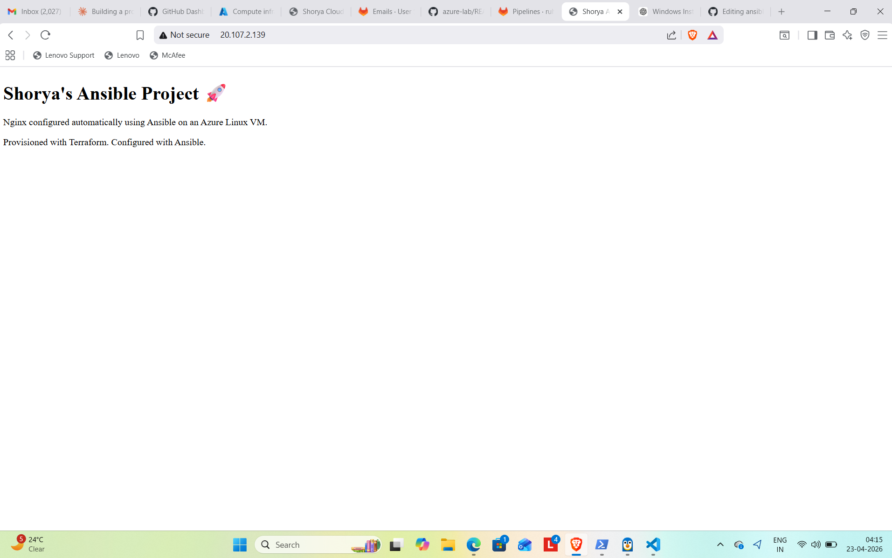

# 🚀 Azure Ansible Nginx Automation

---

## 🧠 Overview

This project demonstrates **end-to-end infrastructure and configuration automation** on Azure.

* Infrastructure is provisioned using **Terraform**
* Configuration is automated using **Ansible**
* A Linux VM is configured to run **Nginx with a custom web page**

This simulates a real-world DevOps workflow where infrastructure and application setup are fully automated.

---

## ⚙️ Architecture

```
Terraform → Azure VM → SSH → Ansible → Nginx → Custom Web Page
```

---

## 🔄 Workflow

1. Terraform provisions Azure Linux Virtual Machine
2. Public IP is assigned to the VM
3. Ansible connects via SSH
4. System packages are updated
5. Nginx is installed and started
6. Custom HTML page is deployed
7. Web server is restarted automatically

---

## 🛠️ Tech Stack

* **Cloud:** Microsoft Azure
* **IaC:** Terraform
* **Configuration Management:** Ansible
* **OS:** Ubuntu Linux
* **Web Server:** Nginx
* **Environment:** WSL (Windows Subsystem for Linux)

---

## 📸 Output

### 🔧 Ansible Execution

<p align="center">
  
</p>

### 🌐 Live Web Page

<p align="center">
  
</p>

---

## 📂 Project Structure

```
ansible-lab/
├── hosts                # Inventory file
├── install_nginx.yml    # Ansible playbook
├── README.md            # Documentation
├── .gitignore
└── images/
    ├── ansible-run.png
    └── nginx-page.png
```

---

## ▶️ How to Run

### 1. Clone the repository

```bash
git clone https://github.com/ruhelashorya-repo/ansible-nginx-automation.git
cd ansible-nginx-automation
```

### 2. Update inventory file

Edit `hosts` file:

```ini
[web]
<YOUR_VM_PUBLIC_IP> ansible_user=azureuser
```

### 3. Run playbook

```bash
ansible-playbook -i hosts install_nginx.yml --ask-pass --ask-become-pass
```

---

## 🌍 Live Demo

```
http://<YOUR_VM_PUBLIC_IP>
```

---

## 🔐 Security Note

* No credentials are stored in the repository
* SSH password is entered at runtime
* Best practice would be to use SSH key-based authentication

---

## 🧠 Key Skills Demonstrated

* Infrastructure provisioning using Terraform
* Configuration automation using Ansible
* Linux server management
* Web server deployment (Nginx)
* Remote execution over SSH
* Cloud resource management (Azure)

---

## 🚀 Future Improvements

* Replace password auth with SSH key authentication
* Add Ansible roles for modular structure
* Integrate CI/CD pipeline for automated deployment
* Containerize application using Docker

---

## 👨‍💻 Author

**Shorya Ruhela**
🔗 LinkedIn: https://www.linkedin.com/in/shorya-ruhela
📧 Email: [ruhela.shorya@gmail.com](mailto:ruhela.shorya@gmail.com)

---
